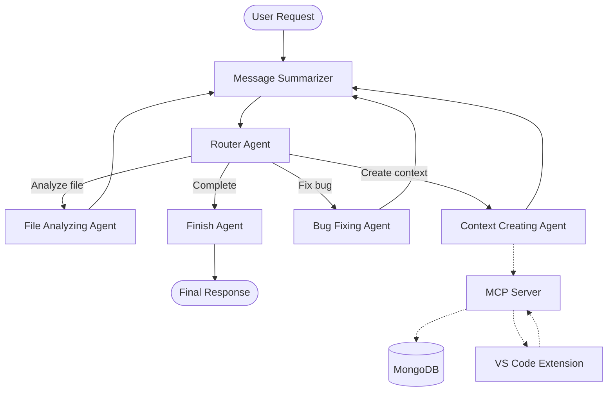
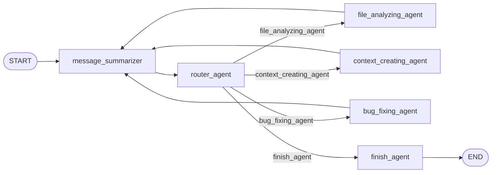
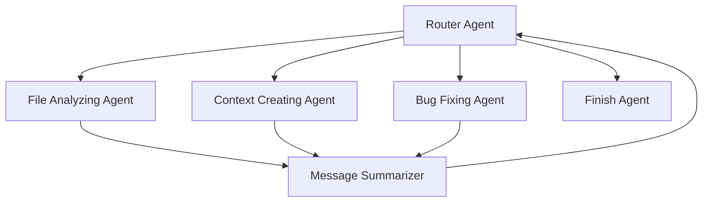

## Architecture

Nyxus uses a multi-agent architecture built with LangGraph. The router decides which specialized worker should execute next, while the workers return to the summarizer before routing again.

### LangGraph Workflow

The core agent workflow is implemented using `StateGraph`:

### Agent Responsibilities

| Agent | Responsibility |
|---|---|
| `message_summarizer` | Summarizes the current conversation and accumulated agent state |
| `router_agent` | Decides which worker should execute next |
| `file_analyzing_agent` | Analyzes repository files and determines relevant files |
| `context_creating_agent` | Builds detailed semantic context for selected files |
| `bug_fixing_agent` | Analyzes and fixes identified issues |
| `finish_agent` | Generates the final response to the user |

### Router Flow

The router can select one of four paths:

This creates an iterative agent loop:

**Summarize → Route → Execute Worker → Summarize → Route → ... → Finish**

A maximum of `20` router iterations is enforced to prevent infinite agent loops.